# 1 Цель работы

Целью данной лабораторной работы является освоение процедуры оформления
отчетов с помощью легковесного языка разметки Markdown.

# 2 Задание

1.  Установка необходимого ПО
2.  Заполнение отчета по выполнению лабораторной работы №3 с помощью
    языка разметки Markdown
3.  Задание для самостоятельной работы

# 3 Теоретическое введение

Markdown - легковесный язык разметки, созданный с целью обозначения
форматирования в простом тексте, с максимальным сохранением его
читаемости человеком, и пригодный для машинного преобразования в языки
для продвинутых публикаций. Внутритекстовые формулы делаются аналогично
формулам LaTeX. В Markdown вставить изображение в документ можно с
помощью непосредственного указания адреса изображения. Синтаксис
Markdown для встроенной ссылки состоит из части \[link text\],
представляющей текст гиперссылки, и части (file-name.md) -- URL-адреса
или имени файла, на который дается ссылка. Markdown поддерживает как
встраивание фрагментов кода в предложение, так и их размещение между
предложениями в виде отдельных огражденных блоков. Огражденные блоки
кода --- это простой способ выделить синтаксис для фрагментов кода.

# 4 Выполнение лабораторной работы

## 4.1 Установление необходимого ПО

### 4.1.1 Установка TexLive

Скачал TexLive с официального сайта. Распаковываю архив (рис. 1)

Рис. 1: Распаковка архива TexLive

Перехожу в распакованную папку с помощью cd. Запускаю скрипт
install-tl-\* с правами root, используя sudo в начале команды (рис. 2)

Рис. 2: Запуск скрипта

Добавляю /usr/local/texlive/2022/bin/x86_64-linux в свой PATH для
текущей и будущих сессий (рис. 3).

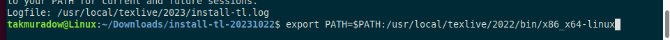

Рис. 3: Добавление в PATH

### 4.1.2 Установка pandoc и pandoc-crossref

Скачиваю архив pandoc версии 2.18. (рис. 4).

Рис. 4: Скачивание pandoc

Скачиваю архив pandoc-crossref 0.3.13.0 (рис. 5).

Рис. 5: Скачивание pandoc-crossref

Распаковываю скачанные архивы (рис. 6).

Рис. 6: Распаковка архивов

Копирую файлы pandoc и pandoc-crossref в каталог /usr/local/bin/ с
правами пользователя root с помощью sudo (рис. 7).

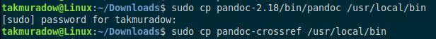

Рис. 7: Копирование каталогов в другую директорию

Проверяю корректность выполненных действий (рис. 8).

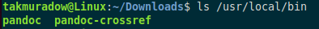

Рис. 8: Проверка правильности выполнения команды

## 4.2 Заполнение отчета по выполнению лабораторной работы №4 с помощью языка разметки Markdown

Открываю терминал. Перехожу в каталог курса, сформированный при
выполненнии прошлой лаборатной работы (рис. 9).

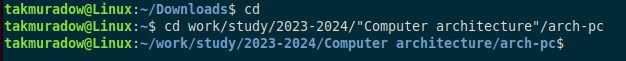
Рис. 9: Перемещение между директориями

Обновляю локальный репозиторий, скачав изменения из удаленного
репозитория с помощью команды git pull (рис. 10).

Рис. 10: Обновление локального репозитория

Перехожу в каталог с шаблоном отчета по лабораторной работе №3 с помощью
cd (рис. 11).

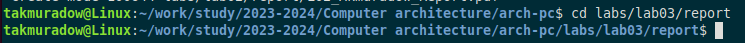

Рис. 11: Перемещение между директориями

Компилирую шаблон с использованием Makefile, вводя команду make (рис.
12).

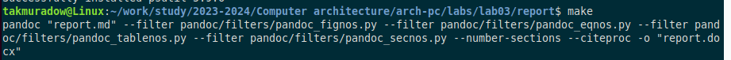
Рис. 12: Компиляция шаблона

Открываю сгенерированный файл report.docx LibreOffice (рис. 13).

Рис. 13: Открытие файла docx

Открываю сгенерированный файл report.pdf (рис. 14). Убедился, что все
правильно сгенерировалось.

Рис. 14: Открытие файла pdf

Удаляю полученные файлы с использованием Makefile, вводя команду make
clean (рис. 15). С помощью команды ls проверяю, удалились ли созданные
файлы.

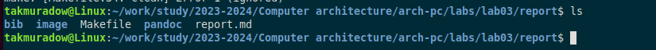

Рис. 15: Удаление файлов

Открываю файл report.md с помощью любого текстового редактора mousepad
(рис. 16).

Рис. 16: Открытие файла report.md

Я хочу, чтобы у меня на всякий случай сохранился шаблон отчета, поэтому
копирую файл с новым названием с помощью утилиты cp (рис. 17).

Рис. 17: Копирование файла с новым именем

Начинаю заполнять отчет с помощью языка разметки Markdown в
скопированном файле (рис. 18).

Рис. 18: Заполнение отчета

Компилирую файл с отчетом. Загружаю отчет на GitHub.

## 4.3 Задание для самостоятельной работы

1.  Перехожу в директорию lab02/report с помощью cd, чтобы там заполнять
    отчет по второй лабораторной работе (рис. 19).

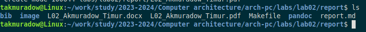

Рис. 19: Перемещение между директориями

Копирую файл report.md с новым именем для заполнения отчета (рис. 20).

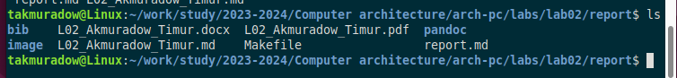

Рис. 20: Копирование файла

Открываю файл с помощью текстового редактора mousepad и начинаю
заполнять отчет (рис. 21).

Рис. 21: Работа над отчетом

Удаляю предыдущий файл отчета, чтобы при компиляции он мне не мешал
(рис. 22).

Рис. 22: Удаление предыдущих файлов

Компилирую файл с отчетом по лабораторной работе (рис. 23).

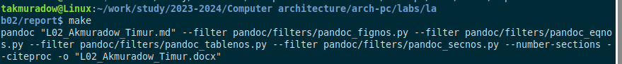

Рис. 23: Компиляция файлов

2.  Удаляю лишние сгенерированные файлы report.docx и report.pdf (24).

Рис. 24: Удаление лишних файлов

Добавляю изменения на GitHub с помощью комнадой git add и сохраняю
изменения с помощью commit (25).

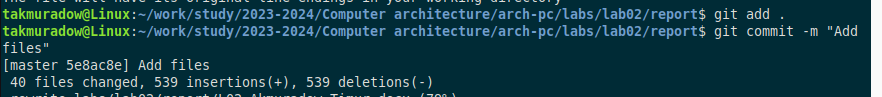

Рис. 25: Добавление файлов на GitHub

Отправляю файлы на сервер с помощью команды git push (26).

Рис. 26: Отправка файлов

# 5 Выводы

В результате выполнения данной лабораторной работы я освоил процедуры
оформления отчетов с помощью легковесного языка разметки Markdown.

# 6 Список литературы

1.  [Архитектура
    ЭВМ](https://esystem.rudn.ru/pluginfile.php/1584625/mod_resource/content/1/%D0%9B%D0%B0%D0%B1%D0%BE%D1%80%D0%B0%D1%82%D0%BE%D1%80%D0%BD%D0%B0%D1%8F%20%D1%80%D0%B0%D0%B1%D0%BE%D1%82%D0%B0%20%E2%84%964.pdf)
